# 🛡️ OpsKnight Documentation (v1.3)

Welcome to the **OpsKnight v1.3** documentation. OpsKnight is the open-source incident management, on-call scheduling, and reliability platform built for DevOps and SRE teams.

---

## 🧭 Documentation Map

```mermaid
graph TD
    A[OpsKnight v1.3] --> B[Getting Started]
    A --> C[Core Concepts]
    A --> D[24+ Integrations]
    A --> E[ChatOps War Rooms]
    A --> F[Security & Hardening]
    A --> G[Production Deployment]

    B --> B1[60s Quickstart]
    B --> B2[Docker / Compose]
    B --> B3[Kubernetes Helm]

    C --> C1[Incidents & Triage]
    C --> C2[On-Call Rotations & Overrides]
    C --> C3[Tier-2 SLA Engine]

    D --> D1[Zabbix / Nagios / Icinga]
    D --> D2[PagerDuty Events v2]
    D --> D3[Datadog / Prometheus / Grafana]
    D --> D4[GitLab / Vercel / GitHub]

    E --> E1[Incident Channels]
    E --> E2[Slash Commands]
    E --> E3[Emoji Note Sync]

    F --> F1[Master Key Encryption]
    F --> F2[Timing-Safe HMAC Webhooks]
    F --> F3[Anti-Replay Signatures]
```



---

## 📚 Core Navigation

<div class="grid grid-cols-1 md:grid-cols-2 gap-4 my-6">

### ⚡ [Getting Started](./getting-started/README.md)
Spin up OpsKnight locally or in production within 60 seconds.
- [Quick Start Guide](./getting-started/README.md)
- [Installation & Prerequisites](./getting-started/installation.md)
- [Initial Admin Setup](./getting-started/README.md#initial-setup)

### 🧩 [Core Concepts](./core-concepts/README.md)
Learn the foundational architecture powering incident response.
- [Services & Team Ownership](./core-concepts/services.md)
- [Incidents & State Lifecycle](./core-concepts/incidents.md)
- [On-Call Schedules & Overrides](./core-concepts/schedules.md)
- [Multi-Tier Escalation Policies](./core-concepts/escalation.md)
- [Slack ChatOps Incident War Rooms](./core-concepts/war-rooms.md)
- [Tier-2 SLA Engine & Business Hours](./core-concepts/sla-engine.md)

### 🔌 [24+ Inbound Integrations](./integrations/README.md)
Connect your entire observability, APM, and CI/CD ecosystem.
- **Metrics & Daemons**: [Zabbix](./integrations/metrics-alerting/zabbix.md) · [Nagios](./integrations/metrics-alerting/nagios.md) · [Icinga 2](./integrations/metrics-alerting/icinga.md) · [Prometheus](./integrations/metrics-alerting/prometheus.md) · [Grafana](./integrations/apm-monitoring/grafana.md)
- **CI/CD Pipelines**: [GitLab CI/CD](./integrations/ci-cd/gitlab.md) · [Vercel](./integrations/ci-cd/vercel.md) · [GitHub Actions](./integrations/ci-cd/github.md) · [Bitbucket](./integrations/ci-cd/bitbucket.md)
- **APM & Tracing**: [Datadog](./integrations/apm-monitoring/datadog.md) · [New Relic](./integrations/apm-monitoring/new-relic.md) · [Dynatrace](./integrations/apm-monitoring/dynatrace.md) · [AppDynamics](./integrations/apm-monitoring/appdynamics.md) · [Sentry](./integrations/apm-monitoring/sentry.md) · [Honeycomb](./integrations/apm-monitoring/honeycomb.md)
- **Cloud Infrastructure**: [AWS CloudWatch](./integrations/cloud/aws-cloudwatch.md) · [Azure Monitor](./integrations/cloud/azure-monitor.md) · [Google Cloud](./integrations/cloud/google-cloud-monitoring.md)
- **Drop-in Emulation**: [PagerDuty Events API v2](./integrations/custom/pagerduty-emulation.md)
- **Issue Tracking**: [Jira Cloud Bi-Directional](./integrations/issue-tracking/jira.md)

### 🛡️ [Security & Compliance](./security/README.md)
12-factor security model, envelope encryption, and HMAC verification.
- [Master Encryption Key Architecture](./security/master-key.md)
- [Webhook Authentication & Signature Verification](./security/webhook-verification.md)
- [Role-Based Access Control (RBAC)](./security/rbac.md)

### 🏗️ [Architecture & Deep Dives](./architecture/README.md)
Under-the-hood engine specifications and reliability patterns.
- [Outbound Circuit Breakers & Retries](./architecture/circuit-breakers.md)
- [Collision-Resistant Deduplication Engine](./architecture/deduplication-engine.md)
- [Sequential Notification Pipeline](./architecture/notification-pipeline.md)

### 📦 [Production Deployment](./deployment/README.md)
Production-grade deployment guides and infrastructure manifests.
- [Docker Compose & GHCR Image Pinning](./deployment/docker.md)
- [Kubernetes Helm Chart](./deployment/helm.md)
- [Kustomize GitOps Manifests](./deployment/kubernetes.md)

### 🔧 [Troubleshooting & Support](./troubleshooting.md)
Forensic diagnostic matrix across all 24 integrations, schedulers, and webhooks.
- [Integration Diagnostic Matrix](./troubleshooting.md#integrations)
- [Timezone & Schedule Verification](./troubleshooting.md#scheduling)

</div>

---

## 📦 Container Registry

Production Docker images are published publicly to GitHub Container Registry (GHCR):

```bash
# Pin production v1.3.0 release
docker pull ghcr.io/opsknight-labs/opsknight:1.3.0

# Track latest stable release
docker pull ghcr.io/opsknight-labs/opsknight:latest
```
