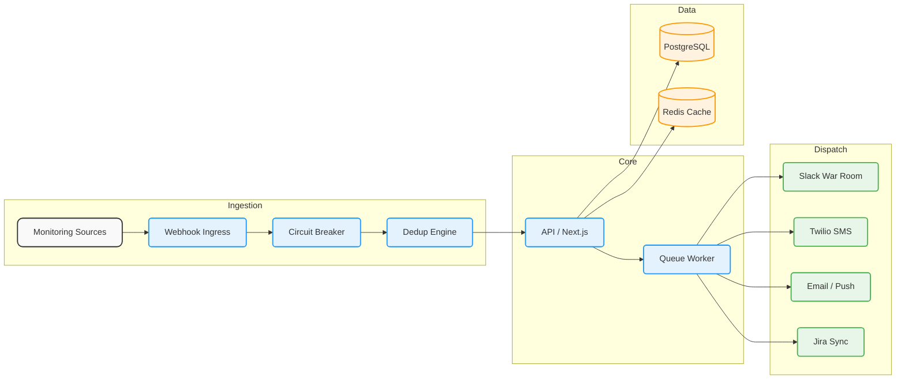

# System Architecture

OpsKnight is engineered as a high-performance Next.js application with modular services, background queue workers, state-machine-driven circuit breakers, and sub-millisecond deduplication.

---

## High-Level Architectural Flow

---

## 📚 Deep Dive Architecture Specifications

| Architecture Topic | Key Components & Focus | Guide Link |
| :--- | :--- | :--- |
| **Circuit Breakers** | Cascading failure prevention, state machine transitions (`CLOSED`, `OPEN`, `HALF_OPEN`), and exponential backoff | [Circuit Breakers Specification](./architecture/circuit-breakers) |
| **Deduplication Engine** | SHA-256 event fingerprinting, sliding window correlation, and noise suppression | [Deduplication Engine Guide](./architecture/deduplication-engine) |
| **Enterprise Observability** | 24+ integration architecture, payload normalization pipelines, and dispatch routing | [Enterprise Observability](./architecture/enterprise-observability) |
| **Dashboard Architecture** | Real-time incident command center, keyboard hotkeys, and server component design | [Dashboard Architecture](./architecture/dashboard) |
| **System Settings** | Role-based access control (RBAC), API key hashing, and credential isolation | [Settings Architecture](./architecture/settings) |
| **System Flow Diagrams** | Sequence diagrams for incident lifecycle, escalation triggers, and postmortem loops | [Architecture Diagrams](./architecture/diagrams) |
