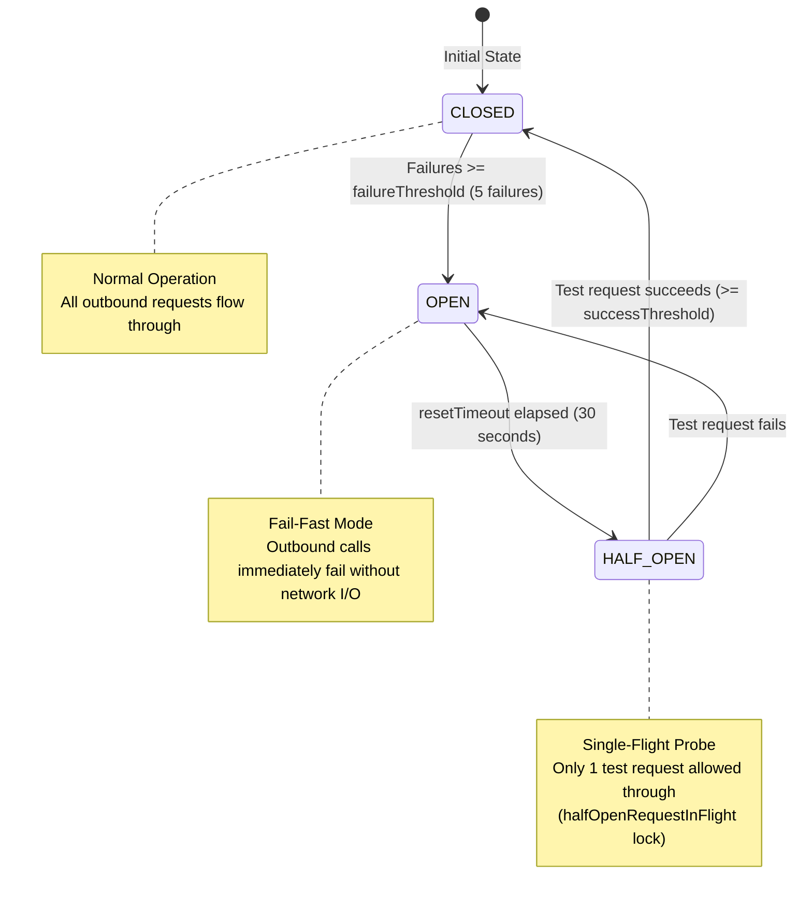

# Circuit Breakers & Outbound Reliability

OpsKnight employs the **Circuit Breaker Pattern** across all outbound communication channels (Email, SMS, WhatsApp, Webhooks, and Slack) to prevent cascading failures when external providers experience degradation.

---

## ⚡ State Machine Architecture



---

## 🛡️ Thundering Herd Prevention in `HALF_OPEN`

When a circuit breaker transitions from `OPEN` to `HALF_OPEN`, traditional implementations allow all queued concurrent requests to flood the recovering service simultaneously.

OpsKnight eliminates this with an atomic single-flight lock:

```typescript
if (this.state.state === 'HALF_OPEN') {
  if (this.state.halfOpenRequestInFlight) {
    // Reject concurrent requests while the single probe is in flight
    throw new Error(`[CircuitBreaker:${this.config.name}] Probe in progress, circuit temporarily open`);
  }
  this.state.halfOpenRequestInFlight = true;
}
```

- If the probe **succeeds**, the circuit resets to `CLOSED`, clearing the queue.
- If the probe **fails**, the circuit immediately trips back to `OPEN` for another full `resetTimeout` cycle.

---

## 🔄 Exponential Backoff & HTTP 429 Handling

The retry engine wraps outbound calls with full jitter to avoid synchronous request spikes:

$$t_{\text{backoff}} = \min(t_{\text{max}}, t_{\text{base}} \times 2^{\text{attempt}}) \pm \text{jitter}$$

### `Retry-After` Header Respect

When an external provider (such as Slack or Twilio) returns an `HTTP 429 Too Many Requests`:
1. OpsKnight parses the `Retry-After` header (handling both seconds integers and HTTP-date strings).
2. The retry engine yields execution for the requested duration without double-sleeping in outer loops.
3. If rate limits persist past maximum retry attempts, the notification drops gracefully to the sequential fallback channel (`push -> sms -> whatsapp -> email`).
