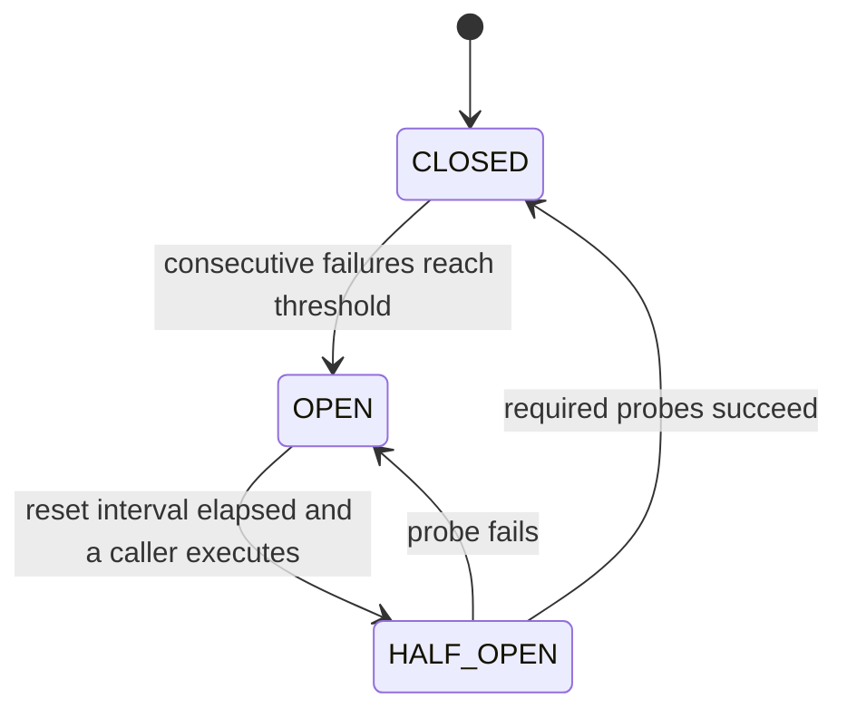

# Circuit breakers and outbound failure handling

OpsKnight wraps selected outbound email, SMS, web push, WhatsApp, and webhook calls in process-local circuit breakers. A circuit reduces repeated calls to a failing provider; it does not deliver the message, move traffic to another replica, or guarantee an automatic fallback channel.

Slack uses its own retry path in v1.3. Although a Slack breaker factory exists in source, the active Slack send paths do not use it, so do not assume Slack circuit state follows this page.

## State model

- **CLOSED:** calls run with the configured breaker timeout. A success resets the consecutive failure count.
- **OPEN:** calls fail immediately with a circuit-breaker error until the reset interval has elapsed.
- **HALF_OPEN:** one probe can be in flight. Concurrent calls fail fast. A failed probe reopens the circuit; two successful probes close it with the current default success threshold.

The timeout wrapper rejects the OpsKnight operation after its limit. It does not universally abort the underlying provider request; webhook callers also supply an abort signal, while channel implementations have their own network behavior.

## Active channel configuration

| Protected path         | Failure threshold | Reset interval | Breaker timeout | State key            |
| ---------------------- | ----------------: | -------------: | --------------: | -------------------- |
| Email                  |                 5 |     60 seconds |      15 seconds | `email`              |
| SMS                    |                 3 |     30 seconds |      10 seconds | `sms`                |
| Web push               |                10 |     30 seconds |       5 seconds | `push`               |
| WhatsApp               |                 3 |     30 seconds |      10 seconds | `whatsapp`           |
| Service/status webhook |                 3 |     60 seconds |      10 seconds | destination hostname |

Failures are consecutive within the life of that circuit object because a successful call in `CLOSED` resets its counter. Webhook destinations on the same hostname share a circuit in one process even when their paths differ.

## Persistence and replicas

Circuit state lives in a module-level memory map:

- it resets when the application process restarts;
- it is not stored in PostgreSQL;
- it is not shared between replicas; and
- there is no published v1.3 admin API for inspecting or resetting it.

Consequently, one replica can be open while another still calls the provider. Use provider telemetry, OpsKnight logs, and notification history for the deployment-wide view.

## Relationship to retries

Circuit breakers and retries are separate controls.

- Generic service webhooks and status-page webhooks retry selected network, timeout, HTTP 429, and HTTP 5xx failures up to their configured attempt limit.
- Slack send paths use the shared retry-fetch helper and can honor `Retry-After` for HTTP 429 responses, capped by implementation limits.
- Failed notification records can be selected later by the internal scheduler, subject to their attempt state.
- A circuit-open notification result is recorded as failed but does not increment the notification's ordinary attempt count at that point.

There is no universal sequential fallback such as push → SMS → WhatsApp → email. Delivery channels come from escalation rules, service settings, and user/provider configuration.

## What operators should expect

A circuit-open error means OpsKnight deliberately did not begin another provider call in that process. Wait for the reset interval or restore the provider/configuration, then verify recovery with a controlled test. Do not restart replicas merely to clear circuit state: that removes the protective history and can create another burst against an unhealthy provider.

When paging is impaired:

1. Confirm whether the failure affects one channel, hostname, or all providers.
2. Inspect notification history and system logs for timeout, provider response, circuit-open, and retry evidence.
3. Check provider status, quota, credentials, sender identity, and network egress.
4. Use an independently configured response channel for active incidents.
5. After remediation and the reset interval, send a test and then a synthetic incident.
6. Verify the notification is recorded as delivered and reaches the target device/account.

## Contributor guidance

Use a stable breaker key at the intended isolation boundary. A key that is too broad lets one tenant or destination suppress unrelated delivery; a key that is too narrow defeats failure aggregation.

Do not describe a channel as protected until its active call path invokes the breaker. Tests should cover timeout, threshold transition, open fail-fast, one half-open probe, failed probe, two successful recovery probes, and process-local state.

## Implementation map

- `src/lib/circuit-breaker.ts` — state machine and configured factories.
- `src/lib/notifications.ts` — email, SMS, push, and WhatsApp use.
- `src/lib/webhooks.ts` — service webhook retry and breaker use.
- `src/lib/status-page-webhooks.ts` — status webhook retry and breaker use.
- `src/lib/slack.ts` and `src/lib/retry.ts` — Slack's separate retry path.
