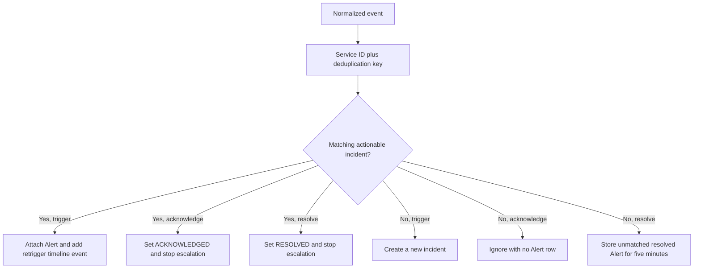

# Event correlation and deduplication

OpsKnight correlates inbound events so repeated signals update an actionable incident instead of opening a new incident every time. Correlation depends on the service, the normalized `dedup_key`, and the current incident state.

It is not content-based machine learning and it does not infer that differently keyed alerts represent the same failure.

## Correlation identity

The event processor searches for an incident with both:

- the target `serviceId`; and
- the exact normalized `dedup_key`.

Only incidents in `OPEN`, `ACKNOWLEDGED`, `SNOOZED`, or `SUPPRESSED` state are eligible. `RESOLVED` incidents are excluded, so a later trigger with the same key opens a new incident.

The lookup and incident change run in a PostgreSQL serializable transaction. Retryable serialization, deadlock, and selected concurrency errors are retried with short backoff. This reduces concurrent duplicate creation; it is not a guarantee against incorrect keys supplied by an adapter or source.

## Where the key comes from

The published Events API requires a caller-supplied `dedup_key` of 1–200 characters. Provider adapters derive keys from provider identifiers and stable payload fields. The exact basis differs by provider:

- native alert, incident, alarm, monitor, workflow, deployment, check, or fingerprint ID when available;
- stable resource combinations such as account/region/alarm, repository/workflow/ref, or host/service; or
- a name- or title-based fallback when the provider supplies no stable identifier.

Some adapters hash selected fallback material; others use readable composite strings. OpsKnight does not hash every provider key. The event processor preserves keys up to 512 characters for internal callers and, for longer values, keeps a prefix plus a SHA-256 suffix so the stored key fits the limit.

See [Inbound webhook reference](../integrations/inbound-webhook-reference) for each provider's documented correlation basis.

## Trigger behavior

For the first trigger without a match, OpsKnight creates an `Alert`, creates an `OPEN` incident, attaches the alert, writes an incident timeline event, and returns `action: triggered`.

For a repeated trigger with a match, OpsKnight creates another `Alert`, attaches it to the existing incident, writes a retrigger timeline event, and returns `action: deduplicated`. Deduplication does not discard the evidence that another alert arrived.

The incident title and description are not continuously replaced by every duplicate event. Use the attached alerts and timeline to inspect recurrence.

## Acknowledge and resolve behavior

An acknowledge with no matching actionable incident returns `action: ignored` and does not create an `Alert` row. With a match, it records an alert, sets the incident to `ACKNOWLEDGED`, records the first acknowledgment time, completes escalation, and clears the next escalation time.

A resolve with a match records an alert, sets the incident to `RESOLVED`, records the resolution time, completes escalation, and clears the next escalation time.

### Resolve before trigger

If a resolve arrives before its trigger, OpsKnight stores an unattached resolved alert. A matching trigger received within five minutes creates the incident directly in `RESOLVED` state and attaches both alerts. After that window, the old resolve is not used for this correlation path and the trigger creates an open incident.

This buffer helps with network reordering. It is not an indefinite recovery tombstone.

## Keys must be stable across lifecycle events

A provider's trigger and recovery payload must normalize to the same service and key. Common causes of duplicate or unresolved incidents are:

- including a changing timestamp or request ID in a custom key;
- routing recovery to a different OpsKnight service;
- omitting the provider identifier from recovery payloads;
- changing monitor names when the adapter uses a name fallback; or
- reusing one key for unrelated resources.

Send a real failure and recovery from the upstream provider during acceptance testing. Record the incident ID and compare its alert/timeline evidence.

## Notification suppression is separate

The immediate notification queue has its own process-local suppression key: incident ID, user ID, and channel. A matching notification already queued, or processed in the preceding five minutes, is skipped. Old entries are cleaned after approximately ten minutes.

This notification suppression does not merge incidents. It is in memory, is not shared between replicas, and resets on process restart. A full queue can drop new immediate work, and provider delivery has separate retry behavior. See [Technical architecture](../core-concepts/technical-architecture) for durability boundaries.

## Troubleshooting

**Two incidents opened for one provider alert**

Compare service IDs and normalized keys. Confirm the provider supplied its stable identifier on both deliveries and that the first incident was not already resolved.

**Recovery did not resolve the incident**

Compare the trigger and recovery keys and service routes. Check whether the recovery arrived outside the five-minute resolve-before-trigger window or after another workflow changed incident state.

**A duplicate trigger did not send another page**

Incident correlation and notification suppression are different layers. Check the incident timeline, recipient/channel suppression window, escalation state, notification history, and provider logs.

## Implementation map

- `src/lib/events.ts` — incident correlation and lifecycle transaction.
- `src/lib/db-utils.ts` — serializable transaction retry.
- `src/lib/integrations/*` — provider key construction.
- `src/lib/notification-queue.ts` — process-local notification suppression.
