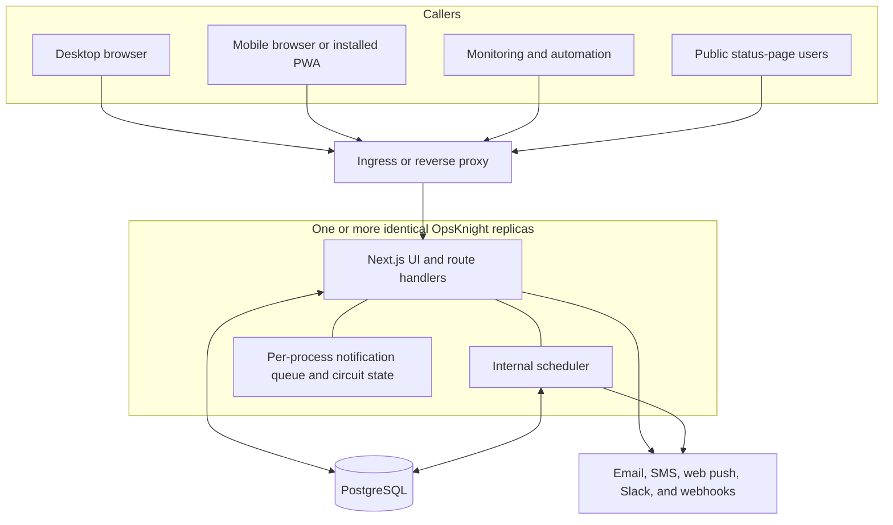
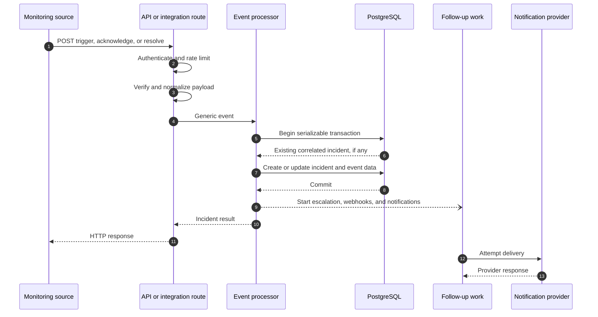
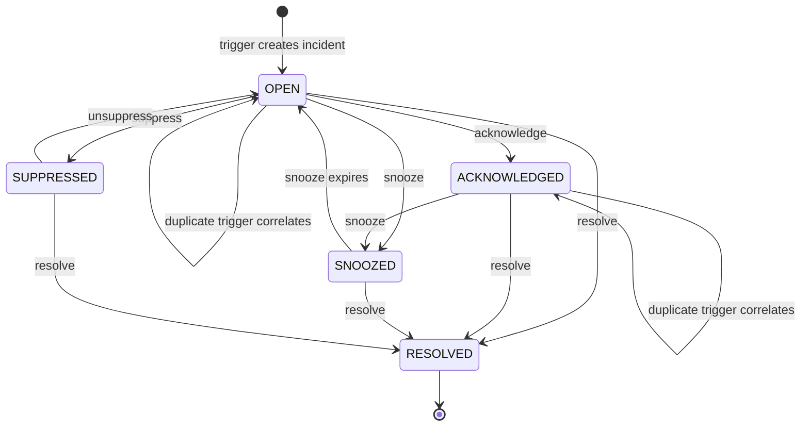
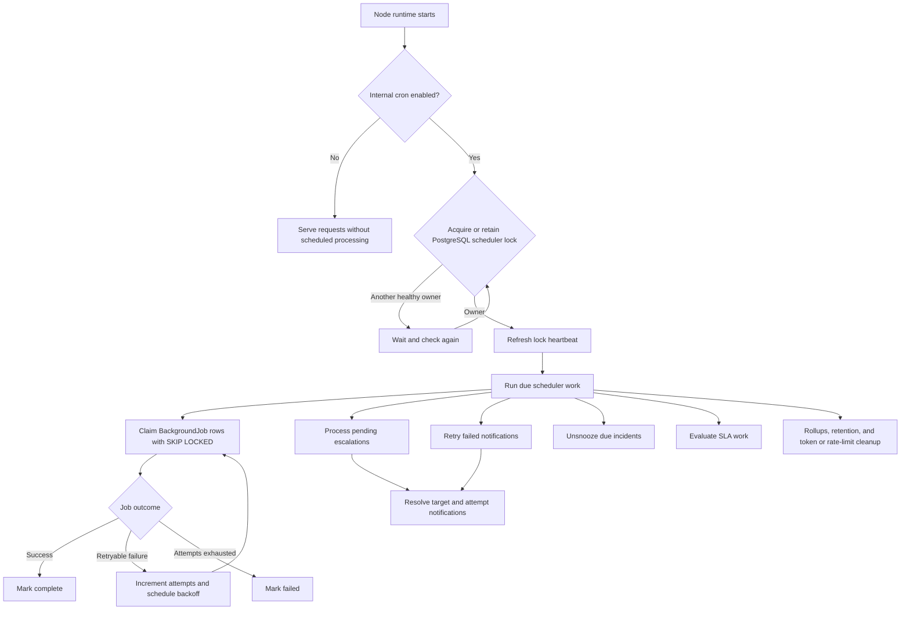
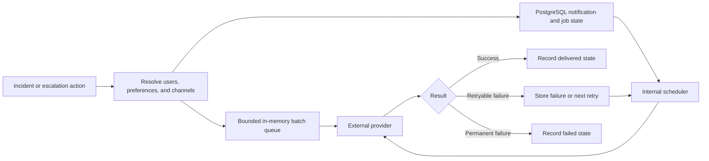
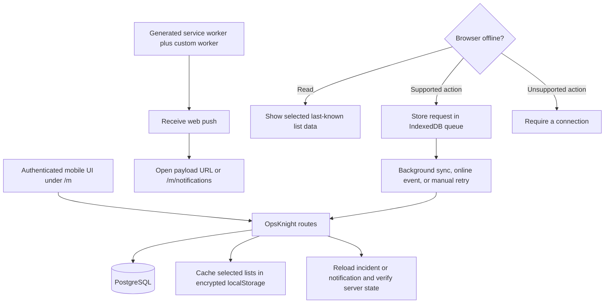

# Architecture diagrams

These diagrams show the v1.3 implementation boundary. OpsKnight runs the web application and internal scheduler in the same Next.js process model, uses PostgreSQL for durable state, and does not require Redis or a separately deployed worker service.

For failure modes and scaling guidance, read [Technical architecture](../core-concepts/technical-architecture).

## Deployment topology

Every replica must use the same PostgreSQL database and compatible secrets. PostgreSQL coordinates scheduler ownership. The memory queue and circuit state are local to each replica.

## Inbound event transaction

The incident database commit and external delivery are not one atomic transaction. An HTTP success proves that the accepted event reached its processing result; notification history and provider telemetry prove delivery.

## Correlation and lifecycle

Escalation is progress associated with an incident; `ESCALATED` is not an incident status. Correlation uses the service and deduplication key and considers actionable states.

## Scheduler and durable jobs

Background jobs are durable in PostgreSQL. A job stuck in `PROCESSING` can be reclaimed after its stale-processing interval. Scheduler progress stops when no healthy instance can own the database lock.

## Notification delivery boundaries

The in-memory path is per process and can be lost during an abrupt exit. PostgreSQL-backed retry state survives a process restart, but neither path can guarantee that an unavailable third-party provider accepts a message.

## Mobile PWA and offline actions

Supported offline writes are limited to mobile-list incident status changes and mobile notification read actions. Cached reads cover selected incident, notification, service, schedule, and team lists. Browser storage can be evicted or cleared, and queued requests can fail authentication, authorization, validation, rate-limit, or conflict checks. See [Mobile PWA](../deployment/mobile-pwa) before relying on this flow operationally.

## Source map

- Runtime and scheduler: `src/instrumentation.ts`, `src/lib/cron-scheduler.ts`
- Event transaction: `src/lib/events.ts`
- Durable jobs: `src/lib/jobs/queue.ts`
- Notification paths: `src/lib/notification-queue.ts`, `src/lib/notification-retry.ts`
- Mobile routes: `src/app/(mobile)/m`
- Offline queue and worker: `src/lib/offline-queue.ts`, `public/custom-sw.js`
