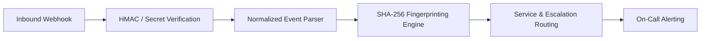

# Integrations Catalog

OpsKnight integrates natively with your entire monitoring, metrics, cloud infrastructure, CI/CD, and observability stack — normalizing payloads and routing alerts to the right on-call engineers in real time.

---

## ⚡ Integration Categories

### Alert Sources (Inbound)

These tools send telemetry and incident alerts **TO** OpsKnight:

| Category | Supported Tools |
| :--- | :--- |
| **APM & Tracing** | Datadog, New Relic, Dynatrace, AppDynamics, Honeycomb, Splunk Observability, Sentry |
| **Cloud & Infrastructure** | AWS CloudWatch, Azure Monitor, Google Cloud Monitoring |
| **Metrics & Server Daemons** | Prometheus / Alertmanager, Grafana, Zabbix, Nagios Core & XI, Icinga 2 |
| **CI/CD & Deployments** | GitHub Actions, GitLab CI/CD, Bitbucket Pipelines, Vercel |
| **Uptime & Health Checks** | UptimeRobot, Pingdom, Better Uptime, Uptime Kuma |
| **Log Analytics & SIEM** | Elastic / Kibana, Splunk On-Call |
| **Issue Tracking (Bi-directional)** | [Jira Cloud](./issue-tracking/jira) |
| **Custom & Emulation** | Generic Webhooks, [PagerDuty Events v2 Emulation](./custom/pagerduty-emulation) |

### Notification Channels (Outbound)

These channels dispatch urgent incident notifications **FROM** OpsKnight:

| Channel | Capabilities |
| :--- | :--- |
| **Slack** | Rich cards, 1-click Acknowledge/Resolve, [Incident War Rooms & ChatOps](./communication/slack-chatops) |
| **Jira Cloud** | [Automatic issue creation, service project routing & note sync](./issue-tracking/jira) |
| **Email** | HTML notification digests with deep-links |
| **SMS** | High-priority Twilio SMS alerts |
| **Push Notifications** | Mobile PWA background push alerts |
| **WhatsApp** | Real-time messaging alerts |
| **Outbound Webhooks** | Generic HTTP POST webhooks with HMAC-SHA256 signatures |

---

## 🔌 Supported Inbound Integrations

### 1. APM & Application Monitoring

#### [Datadog](./apm-monitoring/datadog)
Full-stack monitoring with APM, infrastructure metrics, and logs.
- **Endpoint**: `/api/integrations/datadog`
- **Payloads**: Monitors, Synthetics, APM alerts

#### [New Relic](./apm-monitoring/new-relic)
Application performance monitoring and infrastructure alerts.
- **Endpoint**: `/api/integrations/newrelic`
- **Payloads**: Alert policies, NRQL violations, synthetics

#### [Dynatrace](./apm-monitoring/dynatrace)
AI-powered full-stack observability and problem detection.
- **Endpoint**: `/api/integrations/dynatrace`
- **Payloads**: Problems, anomaly detection, root cause analysis

#### [AppDynamics](./apm-monitoring/appdynamics)
Application performance management and business transactions.
- **Endpoint**: `/api/integrations/appdynamics`
- **Payloads**: Health rules, policy violations

#### [Grafana](./apm-monitoring/grafana)
Grafana Unified Alerting and legacy dashboard alerts.
- **Endpoint**: `/api/integrations/grafana`
- **Payloads**: Unified alerting webhooks, legacy alerts

#### [Honeycomb](./apm-monitoring/honeycomb)
Observability and distributed tracing triggers.
- **Endpoint**: `/api/integrations/honeycomb`
- **Payloads**: Triggers, query results

#### [Sentry](./apm-monitoring/sentry)
Real-time error tracking and performance monitoring.
- **Endpoint**: `/api/integrations/sentry`
- **Payloads**: Issue alerts, metric alerts, webhook events

#### [Splunk Observability](./apm-monitoring/splunk-observability)
Splunk APM and infrastructure detector alerts.
- **Endpoint**: `/api/integrations/splunk-observability`
- **Payloads**: Detectors, signalflow alerts

---

### 2. Cloud & Infrastructure

#### [AWS CloudWatch](./cloud/aws-cloudwatch)
Native AWS alarm notifications via Amazon SNS.
- **Endpoint**: `/api/integrations/cloudwatch`
- **Payloads**: CloudWatch Alarms (`ALARM`, `OK`, `INSUFFICIENT_DATA`), SNS subscriptions

#### [Azure Monitor](./cloud/azure-monitor)
Microsoft Azure Monitor alerts and Common Alert Schema.
- **Endpoint**: `/api/integrations/azure-monitor`
- **Payloads**: Metric alerts, log search alerts, activity log alerts

#### [Google Cloud Monitoring](./cloud/google-cloud-monitoring)
Google Cloud Monitoring incident webhooks (formerly Stackdriver).
- **Endpoint**: `/api/integrations/gcp-monitoring`
- **Payloads**: Alerting policies, condition triggers

---

### 3. Metrics, Alerting & Server Daemons

#### [Prometheus / Alertmanager](./metrics-alerting/prometheus)
Grouped metric alerts and resolution notifications.
- **Endpoint**: `/api/integrations/prometheus`
- **Payloads**: Prometheus Alertmanager grouped alerts

#### [Zabbix](./metrics-alerting/zabbix) *(New in v1.3)*
Enterprise server, network, and VM monitoring.
- **Endpoint**: `/api/integrations/zabbix`
- **Payloads**: Trigger events, problem state updates, recoveries (`Disaster`, `High`, `Average`, `Warning`, `Information`)

#### [Nagios Core & XI](./metrics-alerting/nagios) *(New in v1.3)*
Host and service state alerting with macro variable parsing.
- **Endpoint**: `/api/integrations/nagios`
- **Payloads**: Host alerts (`DOWN`, `UP`), Service alerts (`CRITICAL`, `WARNING`, `OK`)

#### [Icinga 2](./metrics-alerting/icinga) *(New in v1.3)*
Modern daemon and distributed check results.
- **Endpoint**: `/api/integrations/icinga`
- **Payloads**: Service check results, host notifications, downtime transitions

---

### 4. CI/CD & DevOps

#### [GitHub Actions](./ci-cd/github)
Workflow run failures, security alerts, and deployment events.
- **Endpoint**: `/api/integrations/github`
- **Payloads**: `workflow_run.completed` (`failure`), repository vulnerability alerts

#### [GitLab CI/CD](./ci-cd/gitlab) *(New in v1.3)*
Pipeline failure tracking with commit and branch resolution.
- **Endpoint**: `/api/integrations/gitlab`
- **Payloads**: Pipeline Hook (`failed`, `success`), Job Hook

#### [Bitbucket Pipelines](./ci-cd/bitbucket)
Bitbucket build statuses and pull request pipelines.
- **Endpoint**: `/api/integrations/bitbucket`
- **Payloads**: `repo:commit_status_updated` (`FAILED`, `SUCCESSFUL`)

#### [Vercel Deployments](./ci-cd/vercel) *(New in v1.3)*
Frontend build failures and deployment error monitoring.
- **Endpoint**: `/api/integrations/vercel`
- **Payloads**: `deployment.error`, `deployment.canceled`

---

### 5. Uptime & Synthetic Monitoring

#### [UptimeRobot](./uptime/uptimerobot)
Website and API uptime checks.
- **Endpoint**: `/api/integrations/uptimerobot`
- **Payloads**: Monitor alert webhooks (down/up)

#### [Pingdom](./uptime/pingdom)
Global synthetic uptime checks and transaction monitoring.
- **Endpoint**: `/api/integrations/pingdom`
- **Payloads**: Uptime check state transitions

#### [Better Uptime](./uptime/better-uptime)
Synthetic monitoring and heartbeats.
- **Endpoint**: `/api/integrations/betteruptime`
- **Payloads**: Incident webhook notifications

#### [Uptime Kuma](./uptime/uptime-kuma)
Self-hosted monitoring and container health checks.
- **Endpoint**: `/api/integrations/uptimekuma`
- **Payloads**: Notification webhooks (down/up)

---

### 6. Log Analytics & SIEM

#### [Elastic / Kibana](./logs-events/elastic-kibana)
Elasticsearch cluster and Kibana rule alerting.
- **Endpoint**: `/api/integrations/elastic`
- **Payloads**: Kibana Alerting webhooks, Watcher alerts

#### [Splunk On-Call](./logs-events/splunk-oncall)
Log search alerts and security incident forwarding.
- **Endpoint**: `/api/integrations/splunk-oncall`
- **Payloads**: Alert notifications, incident events

---

### 7. Issue Tracking & Project Management

#### [Jira Cloud](./issue-tracking/jira)
Bi-directional Jira integration for real-time ticket creation and comments.
- **Endpoint**: `/api/integrations/jira`
- **Capabilities**: Auto-create Jira issues, route by service, sync comments, manage postmortem action items

---

### 8. Custom Integrations & Emulation

#### [PagerDuty Emulation (Events API v2)](./custom/pagerduty-emulation) *(New in v1.3)*
Drop-in replacement for PagerDuty Events API v2.
- **Endpoint**: `/api/integrations/pagerduty` (and `/api/events/v2`)
- **Capabilities**: Seamlessly connect any tool with built-in PagerDuty support with 0 code modifications

#### [Generic Webhooks](./custom/webhooks)
Connect custom scripts, internal cron jobs, or proprietary systems.
- **Endpoint**: `/api/integrations/webhook`
- **Capabilities**: Custom JSON mapping, HMAC-SHA256 signature verification

---

## 🛠️ How Normalization & Deduplication Work

1. **Verification**: Inbound requests are validated via HMAC signatures (`X-Hub-Signature-256`, `X-Grafana-Signature`, etc.) or token headers.
2. **Normalization**: Diverse payload schemas are transformed into OpsKnight's unified incident format (`title`, `description`, `urgency`, `service`, `dedup_key`).
3. **Deduplication**: SHA-256 hashes prevent alert storms from opening duplicate tickets for ongoing root-cause events.
4. **Escalation Routing**: Active on-call responders receive notifications across Slack, Push, SMS, and Email according to their team schedule.
