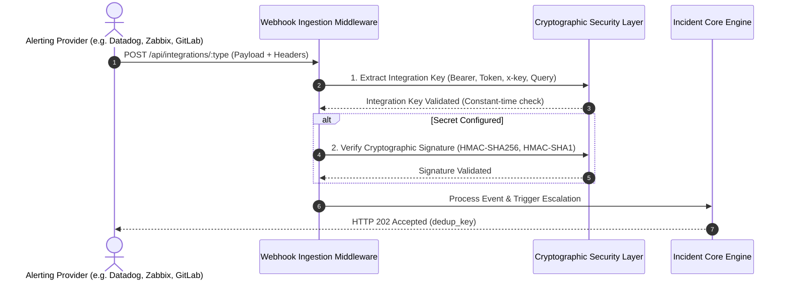

# Webhook Authentication & Signature Verification

OpsKnight implements a **zero-trust, fail-closed** security model for all inbound and outbound webhook traffic.

---

## 🔒 Inbound Webhook Authentication

Every inbound integration route enforces a mandatory two-stage security boundary before payloads reach business logic:



---

## 🔑 Key Extraction & Constant-Time Verification

OpsKnight extracts integration keys across standard headers and fallbacks:

1. `Authorization: Bearer <KEY>`
2. `Authorization: Token token=<KEY>` (PagerDuty v2 standard)
3. `x-integration-key: <KEY>` or `x-api-key: <KEY>`
4. `?integrationKey=<KEY>` or `?key=<KEY>`

### Timing-Safe Equality

To prevent timing-based side-channel attacks on secret keys and signatures, OpsKnight employs `crypto.timingSafeEqual`:

```typescript
function safeEqual(a: string, b: string): boolean {
  const aBuf = Buffer.from(a);
  const bBuf = Buffer.from(b);
  if (aBuf.length !== bBuf.length) {
    // Dummy constant-time comparison prevents leaking length
    crypto.timingSafeEqual(Buffer.alloc(32), Buffer.alloc(32));
    return false;
  }
  return crypto.timingSafeEqual(aBuf, bBuf);
}
```

---

## 🛡️ Supported Signature Providers

OpsKnight provides built-in cryptographic verifiers for all major webhook protocols:

| Provider | Signature Header | Algorithm | Signature Format |
| :--- | :--- | :--- | :--- |
| **GitHub** | `x-hub-signature-256` | HMAC-SHA256 | `sha256=<hex_digest>` |
| **GitLab** | `x-gitlab-token` | Constant-time string | `<secret_token>` |
| **Sentry** | `sentry-hook-signature` | HMAC-SHA256 | `<hex_digest>` |
| **Slack ChatOps** | `x-slack-signature` | HMAC-SHA256 | `v0=<hex_digest>` (with timestamp) |
| **Grafana** | `x-grafana-signature` | HMAC-SHA256 | `<hex_digest>` |
| **Vercel** | `x-vercel-signature` | HMAC-SHA1 | `<hex_digest>` |
| **Generic Webhooks** | `x-signature` / `x-webhook-signature` | HMAC-SHA256 | `<hex_digest>` |

---

## ⏱️ Outbound Anti-Replay Protection

When OpsKnight sends outbound webhooks (e.g. status page notifications, third-party dispatchers), signatures are bound to the delivery timestamp to prevent replay attacks:

```typescript
const timestamp = Math.floor(Date.now() / 1000).toString();
const signedPayload = `${timestamp}.${payloadString}`;
const hmac = crypto
  .createHmac('sha256', secret)
  .update(signedPayload)
  .digest('hex');

// Sent as:
// X-OpsKnight-Timestamp: 1786973846
// X-OpsKnight-Signature: sha256=abcdef12345...
```

Receivers can verify the signature and reject any requests with timestamps older than 300 seconds.
