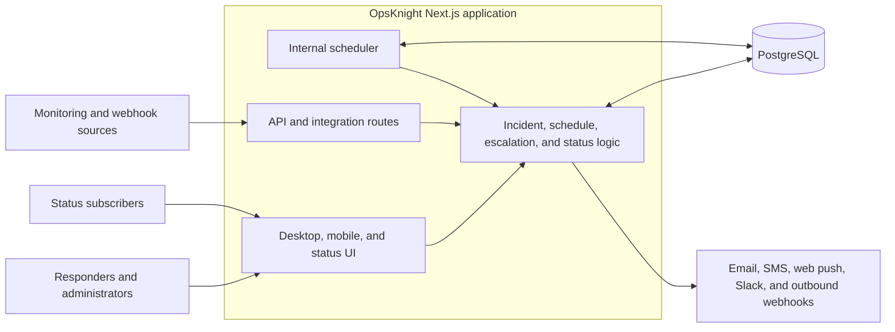
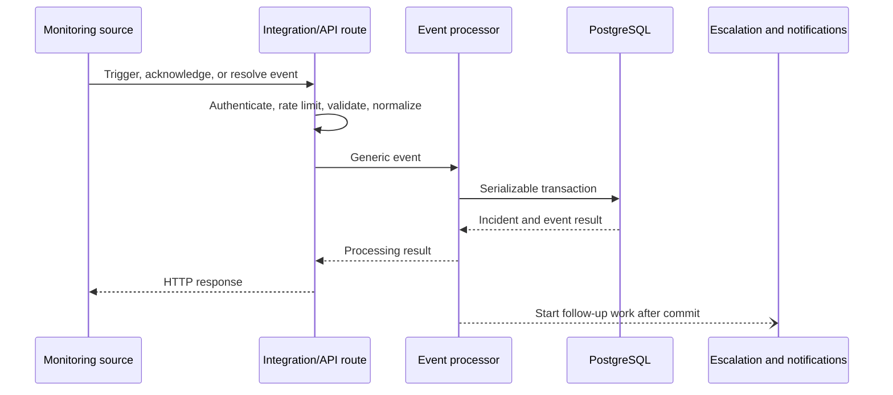

# Technical architecture

OpsKnight v1.4 ships as one Next.js App Router application backed by PostgreSQL. The same application serves the desktop UI, mobile routes under `/m`, public status pages, API routes, integration webhooks, and the internal scheduler. There is no separately deployed worker service and Redis is not a runtime dependency.

This page describes the shipped runtime, including the places where processing is durable and the places where operators must account for process failure.

## Deployed topology

PostgreSQL stores product state, audit records, API rate-limit counters, scheduled work, retry state, and scheduler coordination. The application also uses a bounded in-memory notification queue for batching immediate delivery. That queue exists per process and is not durable across a restart.

## Runtime startup

Next.js calls the instrumentation hook when the Node.js runtime starts. The hook validates the environment and starts the internal scheduler unless `ENABLE_INTERNAL_CRON=false`.

The scheduler:

- coordinates active ownership through a PostgreSQL scheduler-state record;
- treats a lock as stale after five minutes without a valid heartbeat;
- adjusts its loop interval between approximately 15 seconds and two minutes;
- processes due background jobs and pending escalation work;
- retries failed notification records;
- unsnoozes due incidents;
- evaluates SLA work;
- runs rollups and retention cleanup; and
- cleans expired API rate-limit and token records.

Run the scheduler in at least one healthy application instance. If every instance sets `ENABLE_INTERNAL_CRON=false`, requests still work, but scheduled escalations, retries, unsnoozes, SLA checks, and cleanup do not advance.

## Inbound event flow

Provider-specific integrations and the published Events API converge on the incident event processor after authentication, rate limiting, validation, and normalization.

Inside the serializable transaction, OpsKnight uses the service and deduplication key to find an incident in `OPEN`, `ACKNOWLEDGED`, `SNOOZED`, or `SUPPRESSED` state. A repeated trigger updates the matching incident instead of creating an alert storm. An acknowledge or resolve event applies to the matching incident. A resolve received before its trigger can be buffered for a short correlation window.

The transaction is retried when PostgreSQL reports a retryable serialization conflict. This protects the incident write from common concurrent-delivery races; it does not make every downstream provider delivery part of the same database transaction.

## Background work and queues

OpsKnight has two different queueing paths. Their operational properties are different.

### PostgreSQL-backed background jobs

The `BackgroundJob` table stores escalation, notification, automatic-unsnooze, and scheduled-task jobs. Workers claim due jobs with PostgreSQL row locking and `SKIP LOCKED`, so concurrent scheduler loops do not normally process the same row. A job left in `PROCESSING` for ten minutes can be reclaimed. Failed jobs use bounded attempts and exponential backoff.

This path survives an application restart because job state is stored in PostgreSQL. A database outage stops claims and progress until connectivity returns.

### Immediate in-memory notification queue

Immediate notification delivery can pass through a bounded, per-process memory queue. It batches work, applies channel limits, and suppresses recent duplicates. It is not shared between replicas and is lost if that process exits before delivery is recorded.

Failed notification records in PostgreSQL can be selected by the scheduler for retry, but operators must not treat the in-memory handoff or post-commit follow-up promises as a zero-data-loss message broker. Use notification history, system logs, provider telemetry, and synthetic incident tests to verify delivery.

## Incident and escalation processing

An incident can be `OPEN`, `ACKNOWLEDGED`, `SNOOZED`, `SUPPRESSED`, or `RESOLVED`. Escalation progress is related state, not a separate incident status.

For a triggering event, the application resolves the service's escalation policy and targets. Schedule targets are evaluated using layers, rotations, restrictions, and active overrides. Due steps create notification work for the resolved users or teams. Acknowledging or resolving the incident prevents later steps from continuing when the scheduler next evaluates the escalation.

Because provider delivery is external, a successful incident transaction does not prove that email, SMS, push, Slack, or a webhook reached its destination. Delivery state and provider responses are the relevant evidence.

## Notifications and outbound protection

The notification system resolves the recipient, user preferences, enabled provider, and channel before attempting delivery. Provider calls can be protected by timeouts, retries, rate limits, and circuit breakers. Those controls reduce cascading failures; they do not guarantee delivery during a prolonged provider outage.

Store provider secrets through the settings flows described in [Notification providers](../administration/notifications). Review [System logs](../administration/system-logs) and [Audit logs](../administration/audit-logs) when investigating a failed or unexpected action.

## Authentication and authorization

Authentication is implemented with NextAuth credentials and optional generic OIDC. OpsKnight v1.4 does not provide email magic-link authentication or SAML.

Authorization is enforced server-side by route and domain-specific role checks. Integration routes use their own integration credentials, and published API requests use API keys. Do not rely on hidden UI controls as an authorization boundary.

OpsKnight stores incident timeline events and a separate audit log. Do not treat `IncidentEvent` as an immutable, comprehensive compliance ledger for every state change. Define database retention, backups, log export, and external evidence handling according to your compliance requirements.

## Mobile, PWA, and real-time behavior

The mobile UI is part of the same Next.js deployment and uses authenticated `/m` routes. The generated service worker supports installation and web push. Mobile client code stores selected last-known list data in encrypted browser `localStorage`, while a small offline request queue uses IndexedDB. It is not a general offline replica of the application. See [Mobile PWA](../deployment/mobile-pwa) for the exact support matrix and failure boundaries.

Live UI updates can use streaming connections and fall back to polling in selected views. Reverse proxies must allow the relevant long-lived responses and should not cache authenticated application or API responses.

## Availability and scaling boundaries

Multiple application replicas can share one PostgreSQL database. Before scaling horizontally:

1. Run the same application version and configuration on every replica.
2. Keep `NEXTAUTH_SECRET`, `ENCRYPTION_KEY`, provider secrets, and public URL settings consistent.
3. Ensure all replicas can reach the same PostgreSQL database.
4. Leave the internal scheduler enabled on at least one healthy replica; PostgreSQL coordinates scheduler ownership.
5. Remember that each replica has its own in-memory notification queue and circuit-breaker state.
6. Drain traffic before stopping an instance so in-flight requests and immediate notifications have time to finish.
7. Run synthetic trigger-to-delivery tests after deployments and failovers.

High availability also requires redundant ingress, application instances, PostgreSQL protection, backups, and working notification providers. OpsKnight alone cannot provide a zero-data-loss guarantee across database, process, network, and third-party failures.

## Failure checklist

When requests succeed but incident automation appears stalled, check these boundaries in order:

1. **Database:** connection health, capacity, locks, and migration state.
2. **Scheduler:** one instance owns the scheduler lock and its heartbeat is current.
3. **Job backlog:** due background jobs are being claimed and are not exhausting attempts.
4. **Escalation state:** the incident is still actionable and the target resolves to an eligible user.
5. **Provider configuration:** the channel is enabled and credentials are valid.
6. **Delivery evidence:** notification history, system logs, and provider-side logs agree.
7. **Replica lifecycle:** no recent restart dropped process-local work after the incident commit.

## Implementation map

Contributors can verify this behavior in these source areas:

- `src/instrumentation.ts` — runtime initialization.
- `src/lib/cron-scheduler.ts` — scheduler ownership and periodic work.
- `src/lib/jobs/queue.ts` — PostgreSQL-backed background jobs.
- `src/lib/events.ts` — event correlation and incident transaction.
- `src/lib/notification-queue.ts` — process-local batching queue.
- `src/lib/notification-retry.ts` — failed-notification retry selection.
- `src/lib/circuit-breaker.ts` — outbound circuit-breaker behavior.
- `src/app/(mobile)/m` and `public/custom-sw.js` — mobile routes and service-worker extensions.

## Related topics

- [Architecture diagrams](../architecture/diagrams)
- [Database migrations](../deployment/database-migrations)
- [Backup and restore](../deployment/backup-restore)
- [Upgrade and rollback](../deployment/upgrade-rollback)
- [Rate limiting](../api/rate-limiting)
- [Troubleshooting](../troubleshooting)
