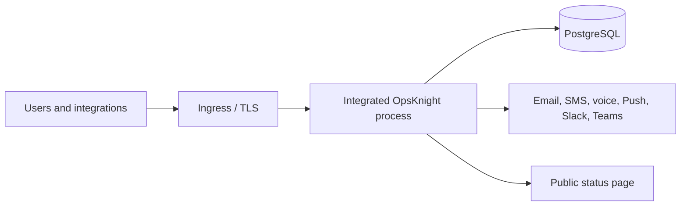
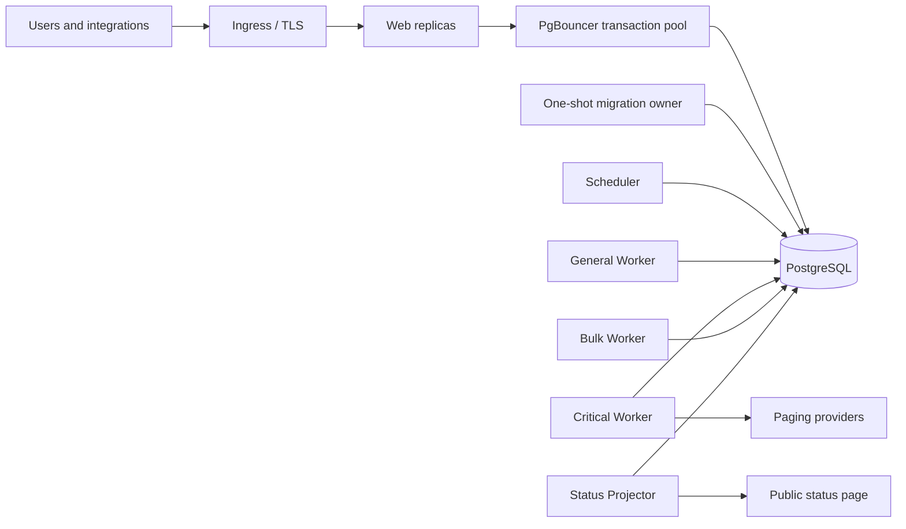
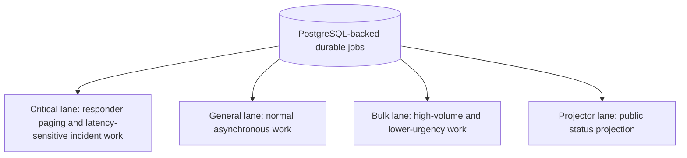
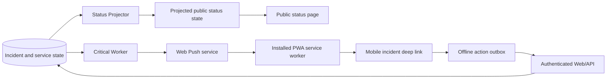

# OpsKnight 2.0 architecture diagrams

These diagrams describe logical ownership. Deployment manifests, network policy,
database connection budgets, and immutable image digests remain the authoritative
installation inputs.

## Integrated topology



The integrated process serves Web traffic and owns the full scheduler plus all
worker lanes. It is the simplest topology but one process shares the HTTP,
scheduling, queue, delivery, and projection failure domain.

## Split topology



Only Web receives ingress. Migration uses a direct PostgreSQL connection. Every
role runs the same immutable image with a different `OPSKNIGHT_PROCESS_ROLE`.
Do not run integrated and split ownership against the same database.

## Incident event and delivery flows

```mermaid
sequenceDiagram
  participant Source as Alert source
  participant Web as Web/API
  participant DB as PostgreSQL
  participant Scheduler as Maintenance scheduler
  participant Critical as Critical worker
  participant General as General worker
  participant Bulk as Bulk worker
  participant Provider as Paging/ChatOps provider
  Source->>Web: Authenticated event
  Web->>DB: Classify, create/deduplicate incident, enqueue durable work
  Critical->>DB: Claim due escalation, recovery, and critical-notification work
  Scheduler->>DB: Run SLA checks, cleanup, reconciliation, and handoff maintenance
  General->>DB: Claim normal operational work
  Bulk->>DB: Claim public-incident, bulk-notification, and status fan-out work
  Critical->>Provider: Send latency-sensitive responder page/card
  Bulk->>Provider: Send bulk/public notification class
  Provider-->>Critical: Outcome/callback
  Provider-->>Bulk: Outcome/callback
  Critical->>DB: Persist attempt and outcome
  Bulk->>DB: Persist attempt and outcome
```

## Queue-lane ownership



Lane isolation protects critical work from bulk pressure; it does not remove
shared PostgreSQL or provider limits.

The Split maintenance scheduler does not execute escalations. The Critical
Worker owns escalation execution and recovery. The scheduler owns periodic SLA
breach checks, queue maintenance, cleanup/reconciliation, and shift/handoff
maintenance. In Integrated mode the single process owns both sets of work.

## Status projection and PWA flow



Push requires a valid same-origin `/sw.js`, an effective Web Push provider, and
a per-device subscription. Offline actions remain authorization-bound when they
are replayed.

## Related pages

- [Integrated versus split runtime](./integrated-vs-split)
- [Runtime roles](./runtime-roles)
- [Database connections](./database-connections)
- [Mobile installation and Push](../../../guides/mobile/install-and-notifications)
